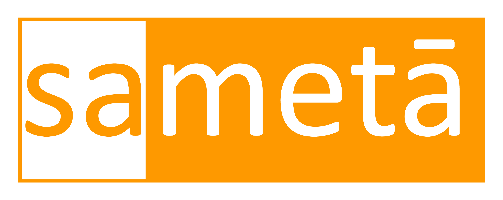

# SAMETA AVTAR

Sameta is culmination of dreams , of like minded individuals who wish to use technology for the benefit of humankind. We believe in adding value to all stake holders, by building a secure platform using state of the art technologies, solving real life business transactional problems.

**Sameta Avtar represents Sameta users in metaverse.** Sameta Avtar is an innovative token derived from the ERC721 standard, designed to provide users with a unique identity within the metaverse. These tokens prioritize user privacy, enabling real-life interactions without compromising personal information.

## Functionality
The `1_SametaAvtarV1.sol` file defines a smart contract named `SametaAvtarV1` which is an upgradeable ERC721 token with additional features such as pausing and access control. The upgradeablity is achieved with UUPS proxy pattern.

**The detailed breakdown of its functionality and flow:**

### Imports
The contract imports several modules from OpenZeppelin's upgradeable contracts library:

* **ERC721URIStorageUpgradeable**: Provides storage-based token URI management for ERC721 tokens.
* **PausableUpgradeable**: Allows the contract to be paused and unpaused.
* **AccessControlUpgradeable**: Provides role-based access control mechanisms.
* **Initializable**: Supports upgradeable contracts by providing an initializer function.
* **UUPSUpgradeable**: Supports upgradeable contracts using the UUPS (Universal Upgradeable Proxy Standard) pattern.

### Contract Declaration
The contract `SametaAvtarV1` inherits from the imported modules, making it an upgradeable ERC721 token with pausing and access control capabilities.

### State Variables
* **transferRestricted**: A boolean flag indicating whether token transfers are restricted. If set to true, only `ISSUER` can transfer token.
* **tokenIdCounter**: A private counter for tracking the next token ID.
* **ISSUER**: A constant `bytes32` value representing the role identifier for the `ISSUER` role.

### Modifiers
* **whenTransferNotRestricted**: A modifier that restricts token transfers to only those accounts with the `ISSUER` role when `transferRestricted` is true. It uses the `hasRole` function to check if the sender has the `ISSUER` role.

### Flow
1. **Initialization**: The contract uses the `Initializable` module to support upgradeable patterns. The `initializer` function would typically be used to set up initial state variables and roles.
2. **Role Management**: The contract uses `AccessControlUpgradeable` to manage roles. The `ISSUER` role is defined using a `keccak256` hash.
3. **Token Management**: The contract inherits `ERC721URIStorageUpgradeable` to manage token URIs and `PausableUpgradeable` to allow pausing of contract functions.
4. **Transfer Restriction**: The `whenTransferNotRestricted` modifier ensures that token transfers can be restricted based on the `transferRestricted` flag and the sender's role.


## DEPLOYMENT INSTRUCTIONS

- Install truffle globally.

        $npm install -g truffle

- Clone the github repo.

        $git clone https://github.com/SametaInfo/sameta-contracts.git

- Install all other packages.

        $npm install

- Create a .env file, copy variables from `.env.sample` and update.

### 1. Deployment
---
- Compile the contracts.

        $npm run compile

- Deploy the contract.

        $npm run deploy:polygonAmoy

  ( NB: change network accordingly. [*refer `truffle-config.js`*] )

- Verify the contract code.

        $npm run verify:polygonAmoy

### 2. Deployment with truffle dashboard

---

- Initiate truffle dashboard.

        $truffle dashboard

  ( This will open new tab on your browser )

- Connect your metamask wallet with dashboard.

  ( NB: you can connect hardware wallets with metamask)

- Compile the contracts.

        $truffle compile

- Deploy the contract.

        $truffle migrate --network dashboard

  ( sign transaction using the dasboard page )

- Verify the contract code.

        $npm run verify:polygonAmoy

## Test

Prerequisite : Truffle ( https://github.com/trufflesuite/truffle#readme ).

### install

```
$npm install
```

### compile

```
$npm run compile
```

### Start Test

```
$npm run test
```

## Deployed Contract Details (Amoy Test Network)

- SametaAvtarV1 - https://amoy.polygonscan.com/address/0x2CB36EAC655C736Fe56a732737d23982C2EE16Fe#readProxyContract

## TODO

* Change to Hardhat instead of Truffle.